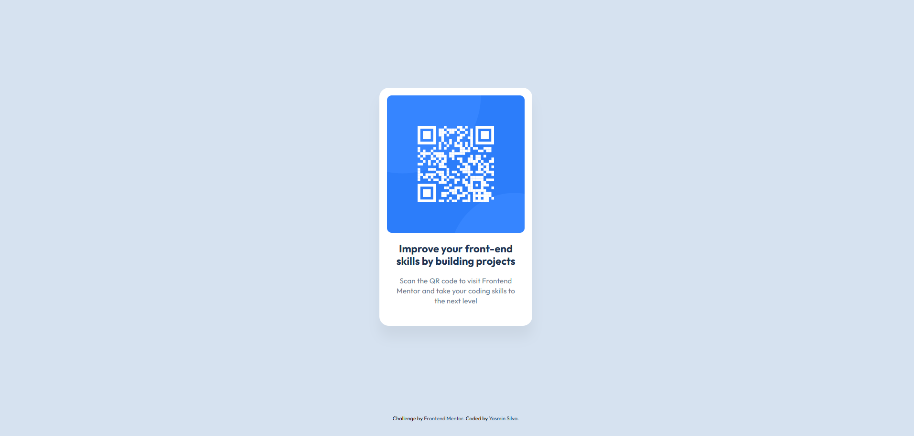

# Frontend Mentor - QR code component solution

This is a solution to the [QR code component challenge on Frontend Mentor](https://www.frontendmentor.io/challenges/qr-code-component-iux_sIO_H).

## Table of contents

- [Overview](#overview)
  - [Screenshot](#screenshot)
  - [Links](#links)
- [My process](#my-process)
  - [Built with](#built-with)
  - [What I learned](#what-i-learned)
  - [Continued development](#continued-development)
- [Author](#author)

## Overview

### Screenshot

### Links

- Solution URL: [GitHub](https://github.com/Yasminxs3/qr-code-component)
- Live Site URL: [QR Code component](https://qr-code-component-rho-three.vercel.app/)

## My process

### Built with

- Semantic HTML5 markup
- CSS custom properties

### What I learned

Although this is a beginner-level challenge, it helped me reinforce some important fundamentals, such as:

- Semantic HTML structure

- Using CSS variables with :root to keep the code organized and reusable.

- Separating styles into an external file (style.css) to improve maintainability.

- Basic responsive design practice using @media queries.

### Continued development

🚀 Continued Development  
I want to keep improving in the following areas:

- **Responsive layouts**: Creating flexible designs that adapt smoothly across different screen sizes without relying on fixed widths and heights.

- **Accessibility (a11y)**: Writing HTML that is more accessible to screen readers and assistive technologies.

- **CSS architecture**: Structuring styles in a scalable and maintainable way.

- **Mobile-first workflow**: Prioritizing smaller screens first and scaling up designs using `min-width` media queries.

- **Performance optimization**: Writing cleaner CSS and reducing unnecessary code or repetition.

These are all areas I want to refine and apply more confidently in future challenges.

## Author

- Frontend Mentor - [@Yasminxs3](https://www.frontendmentor.io/profile/Yasminxs3)
